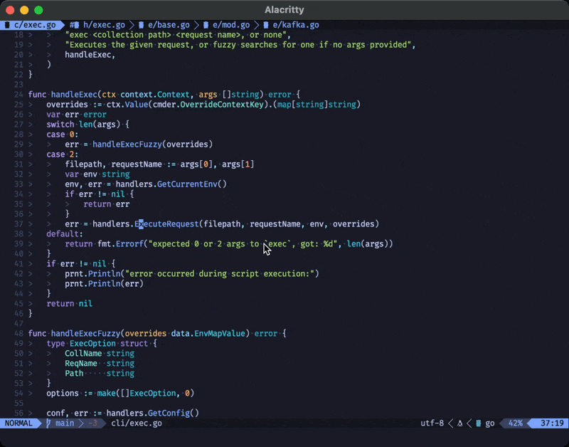
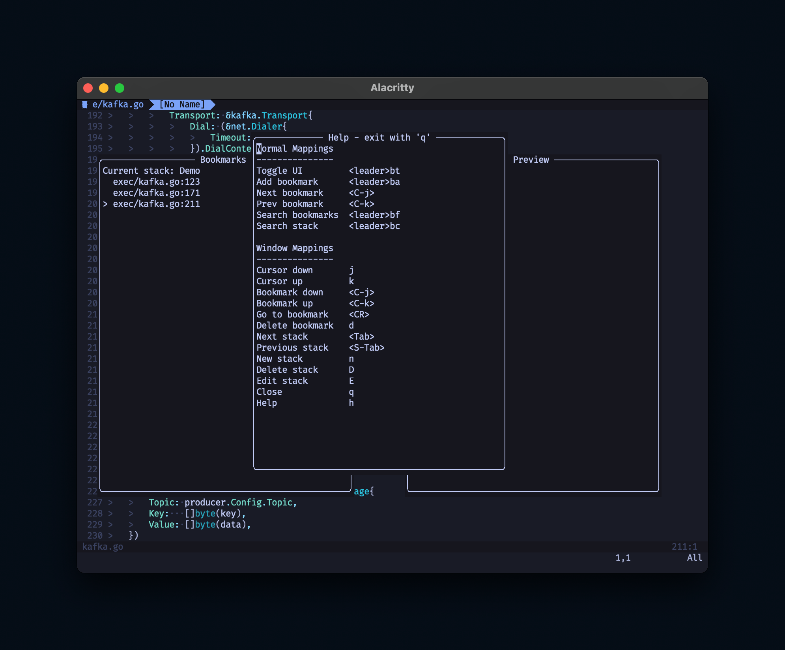

# spelunk.nvim

Marks not cutting it? Create and manage bookmarks more easily, with an easy to use and configurable UI.



## Design Goals
Programming often involves navigating between similar points of interest. Additionally, layers of functionality are often composed together, and thus are often read and edited as part of a stack. `spelunk.nvim` leans into this mental model to allow you to manage bookmarks as related stacks.

`spelunk.nvim` also seeks to take an opinionated approach to configuration. Default keymaps are provided to give the full experience out of the box, as opposed to a build-your-own, API-centric approach. API documentation is provided for those who would prefer to customize their experience.

## Features
- Capture and manage bookmarks as stacks of line number locations
- Opt-in persistence of bookmarks on a per-directory basis
- Togglable UI, with contextual and rebindable controls
- Cycle bookmarks via keybind
- Jump directly to bookmark by index
- Telescope integration - fuzzy find over all bookmarks, or those in the current stack
- Lualine integration - show the number of bookmarks in the current buffer

## Requirements
Neovim (**stable** only) >= 0.10.0

## Installation/Configuration
Via [lazy](https://github.com/folke/lazy.nvim):
```lua
require('lazy').setup({
	{
		'EvWilson/spelunk.nvim',
		dependencies = {
			'nvim-lua/plenary.nvim',         -- For window drawing utilities
			'nvim-telescope/telescope.nvim', -- Optional: for fuzzy search capabilities
		},
		config = function()
			require('spelunk').setup({
				enable_persist = true
			})
		end
	}
})
```

Want to configure more keybinds? Pass a config object to the setup function.
Here's the default mapping object for reference:
```lua
{
	base_mappings = {
		-- Toggle the UI open/closed
		toggle = '<leader>bt',
		-- Add a bookmark to the current stack
		add = '<leader>ba',
		-- Move to the next bookmark in the stack
		next_bookmark = '<leader>bn',
		-- Move to the previous bookmark in the stack
		prev_bookmark = '<leader>bp',
		-- Fuzzy-find all bookmarks
		search_bookmarks = '<leader>bf',
		-- Fuzzy-find bookmarks in current stack
		search_current_bookmarks = '<leader>bc'
	},
	window_mappings = {
		-- Move the UI cursor down
		cursor_down = 'j',
		-- Move the UI cursor up
		cursor_up = 'k',
		-- Move the current bookmark down in the stack
		bookmark_down = '<C-j>',
		-- Move the current bookmark up in the stack
		bookmark_up = '<C-k',
		-- Jump to the selected bookmark
		goto_bookmark = '<CR>',
		-- Jump to the selected bookmark in a new vertical split
		goto_bookmark_hsplit = 'x',
		-- Jump to the selected bookmark in a new horizontal split
		goto_bookmark_vsplit = 'v',
		-- Delete the selected bookmark
		delete_bookmark = 'd',
		-- Navigate to the next stack
		next_stack = '<Tab>',
		-- Navigate to the previous stack
		previous_stack = '<S-Tab>',
		-- Create a new stack
		new_stack = 'n',
		-- Delete the current stack
		delete_stack = 'D',
		-- Rename the current stack
		edit_stack = 'E',
		-- Close the UI
		close = 'q',
		-- Open the help menu
		help = 'h',
	},
	-- Flag to enable directory-scoped bookmark persistence
	enable_persist = false,
	-- Prefix for the Lualine integration
	-- (Change this if your terminal emulator lacks emoji support)
	statusline_prefix = '🔖',
}
```

Check the mentioned help screen to see current keybinds and their use:



### Lualine integration
A default integration with [lualine](https://github.com/nvim-lualine/lualine.nvim) is provided to show the number of active bookmarks in the current buffer. You may override the prefix for this string in the config map above. The result of the provided configuration here can be seen in the demo video above, in the bottom left of the screen.
```lua
  {
    'nvim-lualine/lualine.nvim',
    config = function()
      require('lualine').setup {
        sections = {
          lualine_b = { 'spelunk' },
	  -- Or, added to the default lualine_b config from here: https://github.com/nvim-lualine/lualine.nvim?tab=readme-ov-file#default-configuration
          -- lualine_b = { 'branch', 'diff', 'diagnostics', 'spelunk' },
        },
      }
    end
  },

```

## API Documentation
Here be dragons! This plugin is designed with the default bindings in mind, so there is potential for misuse here. This list will be non-exhaustive to cover just the most useful available functions, with the least potential for sharp edges.

All functions listed can be called like such from within Neovim Lua code:
```lua
require('spelunk').setup(opts)
```

If there is functionality you'd like to see added or exposed, please feel free to open an issue!

- `setup(config)`
	- Description: initialize the plugin, should be called to opt-in to default behavior
	- Parameters:
		- `config` - `table`: a table in the format given in the above Configuration section

- `toggle_window()`
	- Description: toggle the UI open/closed

- `close_windows()`
	- Description: close the UI, if open

- `add_bookmark()`
	- Description: add the line under the cursor as a bookmark

- `move_cursor(direction)`
	- Description: move the cursor in the UI (and underlying state) in the provided direction
	- Parameters:
		- `direction` - `integer` (1 | -1): direction to move the cursor, 1 is down, -1 is up

- `move_bookmark(direction)`
	- Description: move the bookmark in the UI (and underlying state) in the provided direction
	- Parameters:
		- `direction` - `integer` (1 | -1): direction to move the bookmark, 1 is down, -1 is up

- `goto_selected_bookmark()`
	- Description: navigate to the bookmark currently under the cursor in the UI

- `goto_selected_bookmark_horizontal_split()`
	- Description: navigate to the bookmark currently under the cursor in the UI, in a new horizontal split

- `goto_selected_bookmark_vertical_split()`
	- Description: navigate to the bookmark currently under the cursor in the UI, in a new vertical split

- `goto_bookmark_at_index(idx)`
	- Description: navigate to the bookmark at the given index in the current stack
	- Parameters:
		- `idx` - `integer`: index of the bookmark to navigate to

- `delete_selected_bookmark()`
	- Description: delete the bookmark currently under the cursor in the UI

- `select_and_goto_bookmark(direction)`
	- Description: move the cursor in the given direction, then go to that bookmark
	- Parameters:
		- `direction` - `integer` (1 | -1): direction to move the cursor, 1 is down, -1 is up

- `delete_current_stack()`
	- Description: delete the currently selected stack

- `edit_current_stack()`
	- Description: edit the name of the currently selected stack

- `next_stack()`
	- Description: move to the next stack

- `prev_stack()`
	- Description: move to the previous stack

- `new_stack()`
	- Description: create a new stack

- `search_marks()`
	- Description: fuzzy find over all bookmkarks using the Telescope integration

- `search_current_marks()`
	- Description: fuzzy find over bookmkarks in the current stack using the Telescope integration

- `statusline()`
	- Description: get the value that would be set in the status line for the Lualine integration
	- Returns:
		- `string`
